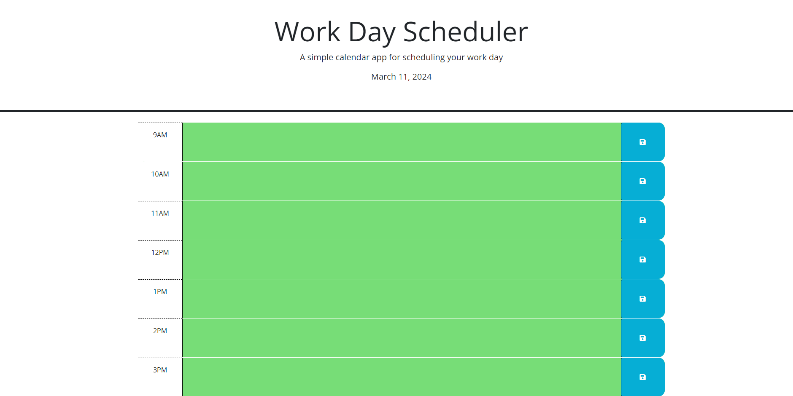

# Daily Planner

Welcome to our daily planner application! This README will guide you through the features and functionality of our scheduler, outlining the criteria completed as per your requirements.

## Criteria Completion:

### Displaying Current Day
- **WHEN** you open the planner
- **THEN** the current day is displayed at the top of the calendar.

### Timeblocks for Standard Business Hours
- **WHEN** you scroll down
- **THEN** you are presented with timeblocks for standard business hours of 9am–5pm.

### Color-coded Timeblocks
- **WHEN** you view the timeblocks for the day
- **THEN** each timeblock is color-coded to indicate whether it is in the past, present, or future.

### Event Entry
- **WHEN** you click into a timeblock
- **THEN** you can enter an event.

### Saving Events
- **WHEN** you click the save button for that timeblock
- **THEN** the text for that event is saved in local storage.

### Persistence of Saved Events
- **WHEN** you refresh the page
- **THEN** the saved events persist.

## Usage:

1. **Opening the Planner:** Upon opening, the current day will be displayed at the top of the calendar.
2. **Scrolling:** As you scroll down, you'll find timeblocks for standard business hours.
3. **Color-coded Blocks:** Each timeblock will be color-coded, helping you differentiate between past, present, and future events.
4. **Entering Events:** Click into a timeblock to enter your event details.
5. **Saving Events:** After entering the event, click the save button associated with that timeblock to store it in local storage.
6. **Persistence:** Even after refreshing the page, your saved events will persist, ensuring you don't lose any important plans.

## Getting Started:

To get started with our daily planner:
1. Clone the repository.
2. Open the `index.html` file in your preferred web browser.
3. Start scheduling your day efficiently!

We hope you find our daily planner helpful for managing your busy schedule. If you have any questions or feedback, feel free to reach out to us.

Happy planning! 📅

